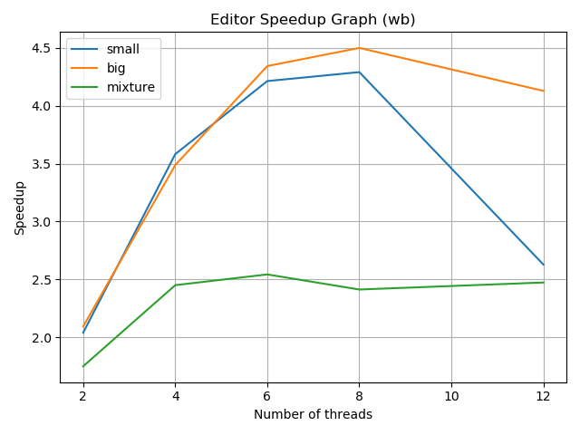
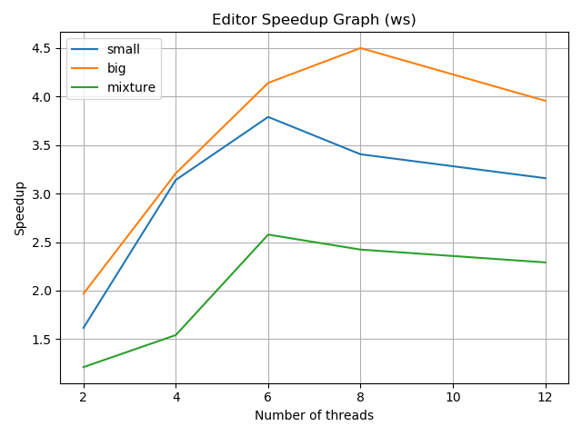
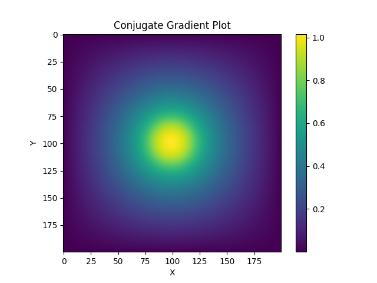
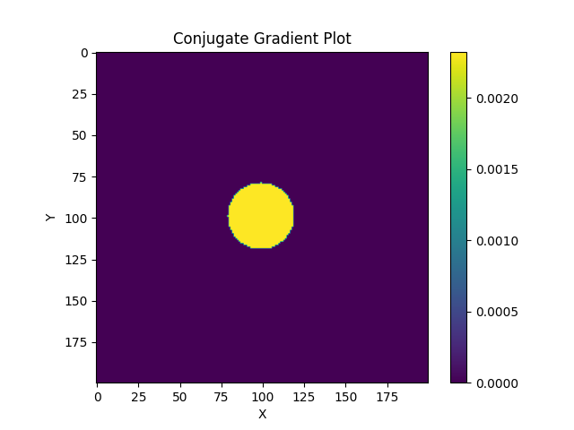
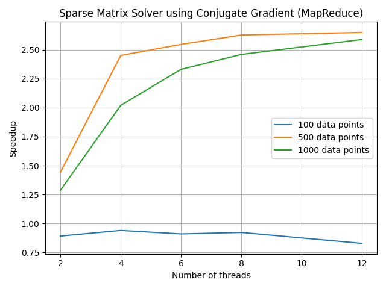

# Project: Image Editor

**Important Note 1** - 

In the project specifications, it is mentioned that all files provided to us are within the `proj3` directory. However, when pulling the repository, there was no `proj3` directory. Since I didn't know if this was on purpose, I have continued without a `proj3` directory. All paths have been appropriately changed and the project for the advanced feature (MapReduce) is inside the `conjugate_gradient` directory. I would have preferred to organize the directory structure a little differently (divide the two projects into two distinct folders) however, I was not sure of the requirements so I have made as little changes to the initial directory structure provided as possible.

**Important Note 2** -

The advanced feature utilizing MapReduce can be found within the `conjugate_gradient` directory. This is a completely separate application. The report for this can be found within the **Advanced Feature** section of this README. I'd like to thank Umang Bhatia for brainstorming ideas with me for the advanced feature project. The conjugate gradient sparse matrix solver was a project I previously did in `C++`, `OpenMP` and `MPI`. The motivation behind reimplementing this in `Go` was to explore how `MPI_Allreduce`, which I used in my previous implementation, can be implemented in `Go`.

**Important Note 3** -
I have added an extra effect that was not present in the `proj2` image editor called `Emboss`. 

**Important Note 4** -
When benchmarking, be sure to change the benchmark scripts provided with the appropriate paths.

### Project Description and Motivation - 

This project is an implementation of an image editor. The motivation behind this project is to improve the compute time taken by image editors. In a digital world, appearances online have become so important, from Zoom meeting filters to liven a call, to Instagram pages to promote products. With the increase in the ubiquity of multi-core machines, parallel computing offers a new paradigm of programming that can take advantage of more compute power to drastically decrease the wait time to produce images that may just brighten someone's day.

In this image editor, images are transformed based on a sequence of effects that are to be applied to each image along with the name of the image to be transformed and the name of the transformed image to be saved. These transformations (effects) are carried by applying specific kernels through a convolution operation over the entire image. For all effects, a 3x3 kernel is convolved over patches (iterating over the entire image). 

The editor processes image tasks specified in three different ways i.e. sequential, work stealing (ws) and work balancing (wb) parallel mode. In work balancing, a thread determines whether it needs to balance work with another thread chosen at random. The decision to balance is based on the balance threshold specified as a command-line argument. If the difference in the number of tasks assigned to a thread's queue and another queue chosen at random, is greater than or equal to the balancing threshold, then the thread will balance work with the other chosen thread. In the work stealing algorithm, upon the completion of all tasks assigned to a thread, the thread will steal work from another thread chosen at random (if of course the other thread's queue contains image tasks to be processed).

### Important System Components - 

1. Data (Input):
    - **I/O takes places in the `data` directory. If there is no `data` directory, you can create one using `mkdir data` while inside the project directory.**
    - Each editor task is provided within the directory `data/effects.txt` file. An example of an editor task is shown below (multiple tasks can be specified by placing one on each line of the `effects.txt` file and are in the `JSON format` - 

        ```JSON
        {"inPath": "IMG_2029.png", "outPath": "IMG_2029_Out.png", "effects": ["G","E","S","B","M"]}
        ``` 
    
    - Input images must be provided within the a directory inside `data/in` directory. If one does not exist, you can create it from within `data` using `mkdir in`. Similarly for the directory. For example, to process an image, we can create  `data/in/small` and place the image inside this directory.  

    - Input images are provided in the `PNG` format.

    - The data can be found [here](https://drive.google.com/drive/folders/17A9GdVSkzKJtFFu2MNuozja8soqulqkD?usp=sharing). **Make sure to copy the `data` folder into the root directory of this project.**


2. Data (Output):

    - **I/O takes places in the `data` directory. If there is no `data` directory, you can create one using `mkdir data` while inside the project directory.**

    - After processing images, the transformed images are saved within the `data/out` directory. If one does not exist, you can create it from from within `data` using `mkdir out`. 

    - Processed images are saved in the `PNG` format.

3. Effects:
    - The following effects can be applied (the appropriate identifier to be used is specified in parenthesis for each effect) - 

        - Grayscale (G) - Each pixel's color channels are computed by averaging over the each the original pixel's color channel values.

        - Sharpen (S) - The following kernel is used as part of the convolution operation applied at every pixel using the convolution operation - 
            
            $$
            \begin{bmatrix}
                0 & -1 & 0\\
                -1 & 5 & -1\\
                0 & -1 & 0
            \end{bmatrix}
            $$
        
        - Blur (B) - The following kernel is used as part of the convolution operation applied at every pixel using the convolution operation - 
            
            $$
            \frac{1}{9}
            \begin{bmatrix}
                1 & 1 & 1\\
                1 & 1 & 1\\
                1 & 1 & 1
            \end{bmatrix}
            $$
        
        - Edge Detection (E) - The following kernel is used as part of the convolution operation applied at every pixel using the convolution operation - 
            
            $$
            \begin{bmatrix}
                -1 & -1 & -1\\
                -1 & 8 & -1\\
                -1 & -1 & -1
            \end{bmatrix}
            $$

        - Emboss (M) - The following kernel is used as part of the convolution operation applied at every pixel using the convolution operation -  

            $$
            \begin{bmatrix}
                -1 & -1 & 0\\
                -1 & 0 & 1\\
                0 & 1 & 1
            \end{bmatrix}
            $$


    - **Note that these identifiers for each effect are case sensitive.**

    - Convolution is performed on a 2D image grid by convolving the kernel across the image. The convolution operation can be thought of as a sliding window computation over the entire image. The computation being performed is the frobenius inner product which is the sum over element wise products between the kernel and patch of image overlapping with the kernel. **Zero padding** is used at the edges of the image. The convolution operation can be seen below - 

        $$y[m,n] = x[m,n] \ast h[m,n] = \sum_{j=-\infty}^{\infty} \sum_{i=-\infty}^{\infty} x[i,j] h[m - i, n - j]$$

4. Run Modes:
    The following modes can be used with the identifier specified in parenthesis (for sequential mode, no mode is specified when running the program).

    - sequential - If no mode is specified, then the sequential version is run.

    - work balancing (wb) - This runs the editor in the parallel work balancing mode, which balances the tasks given to each worker based on the balance threshold specified. The number of threads and the balance threshold must be specified in this mode. Each thread spawned will work on image tasks (including all of the effects for the image task). 

    - work stealing (ws) - This runs the editor in the parallel work stealing mode, in which workers steal tasks from other workers if the worker completes all of the tasks distributed to it. The number of threads must be specified in this mode. Each thread spawned will work on image tasks (including all of the effects for the image task).  

### Running the Program - 

The editor can be run in the following way - 

The first step to run any of the following modes is - 

```console
foo@bar:~$ cd editor
```


1. Sequential run - 

```console
foo@bar:~$ go run editor.go <image directory>
```

2. Parallel runs - 

    1. Work Balancing - 

    ```console
    foo@bar:~$ go run editor.go <image directory> wb <number of threads to be spawned> <balancing threshold>
    ```

    2. Work Stealing - 

    ```console
    foo@bar:~$ go run editor.go <image directory> ws <number of threads to be spawned>
    ```

3. Multiple Input Image Directories - 

If there a images in multiple directories within `data/in`, for example, if there was the directories `small` and `big`, we can chain directories to process using `+` - 

```console
foo@bar:~$ go run editor.go small+big ws <number of threads to be spawned>
```


### Benchmarking the Program - 

**All testing has been carried out on the CS linux cluster i.e. the Peanut Cluster.**

Peanut Cluster specifications - 

```
1. Core architecture - Intel x86_64

2. Model name - Intel(R) Xeon(R) CPU E5-2420 0 @ 1.90GHz

3. Number of threads - 24

4. Operating system - ubuntu

5. OS version - 20.04.4 LTS
```


The program can be benchmarked using the following command - 

```console
foo@bar:~$ sbatch benchmark_editor.sh
```

This must be run within the `benchmark directory`. Make sure to create the `slurm/out` directory inside `benchmark` directory and check the `.stdout` file for the outputs and the timings. 

The graph of speedups obtained can be seen below - 

1. Work balancing mode - 

    

2. Work stealing mode - 

    


The graphs will be created within the `benchmark` directory. The computation of the speedups along with the storing of each of the benchmarking timings and the plotting of the stored data happens by using `benchmark_graph.py` which is called from within `benchmark_editor.sh` (both reside in the `benchmark` directory).


The following observations can be made from the **work balancing** mode graph - 

1. The speedup is almost linear with the number of threads (up to a point). This is because the work is balanced across the threads and the threads are not waiting for each other to complete their tasks.

2. We see a decrease in speedup as the number of threads increases. This is because the overhead of the communication and synchronization between the threads increases as the number of threads increases.

3. We see greater speedups for the small and big images compared to the mixture dataset. This is because in the case of the mixture dataset, since there are different sizes in images, some tasks will finish a lot faster than other tasks, leaving threads that have no work (in the case that the difference in thread local queue sizes is less than the balance threshold, and therefore, no threads steal). 

4. We see greater speedups in the big dataset because the images are larger. This means that the size of the problem amortizes the overhead of the communication and synchronization between the threads (better than in the small image dataset).


The following observations can be made from the **work stealing** mode graph - 

1. Similar to the work balancing mode, we see a close to linear speedup with the number of threads (up to a point). This is because when a thread finishes its tasks, it can steal tasks from other threads. Therefore, the idle time of threads is reduced, and the overall throughput of the application is increased.

2. Once again, we see greater speedups in the big dataset because the images are larger. This means that the size of the problem amortizes the overhead of the communication and synchronization between the threads (better than in the small image dataset).

3. After around 8 threads, we see a decrease in speedup. This is because the overhead of the communication and synchronization between the threads increases as the number of threads increases and we are not able to amortize this cost anymore.

Comparing the two graphs and their parallel implementations, we can observe the following -

1. Work stealing results in greater speedups than work balancing. This is because work stealing reduces the idle time of threads in the case that the threshold to balance in work balancing is too low i.e. the difference in thread local queue sizes is greater than, and therefore, the overall throughput of the application is increased. In my experiments, I tried to keep the threshold as low as possible to see the difference between the two modes. The graphs above are with a balance threshold of 1 which has been hardcoded in the `benchmark/benchmark_graph.py` script but can be specified via the command line when running the `Go` program.

2. We see that after around 8 threads, the speedup decreases in both the work stealing and work balancing modes. This is because the overhead of the communication and synchronization between the threads increases as the number of threads increases and we are not able to amortize this cost anymore. In the work stealing mode, the threads are able to steal tasks from other threads, but this is not enough to offset the overhead of the communication and synchronization between the threads. However, this does decrease the overall idle time of threads in the work stealing mode better than in the work balancing mode. This is why the decrease in speedup in the work stealing mode, is still better than the decrease in speedup in the work balancing mode i.e. after 8 threads, the speedup in the work stealing mode is still greater than the speedup in the work balancing mode despite both have negative speedup i.e slowdown.


### Questions About Implementation - 
 
1. Describe the challenges you faced while implementing the system. What aspects of the system might make it difficult to parallelize? In other words, what to you hope to learn by doing this assignment?

    One operation that can be parallelized is each element wise product taken between the image and the kernel and summed to compute a new pixel value. While the element wise product can be handled by a mapping function which is parallelizable (and subsequently reduced by a reducer to find sum of element wise products) this would involve spawning a lot of threads which would increase the overhead associated with the communication and synchronization between the threads. This makes it difficult to parallelize the system at this level of granularity. The challenge was deciding the granularity at which to parallelize. Though I learened a lot about the work stealing and work balancing paradigms for parallelism, I feel that the most important thing I learned was how to parallelize a system at the right level of granularity.

2. What are the hotspots (i.e., places where you can parallelize the algorithm) and bottlenecks (i.e., places where there is sequential code that cannot be parallelized) in your sequential program? Were you able to parallelize the hotspots and/or remove the bottlenecks in the parallel version?

    The hotspots of the code are (at varying levels of granularity) -

    1. The image tasks (including all effects to be applied for an image).

    2. The convolution operation over a single image as multiple threads can work on the same effect of on an image.

    3. The element wise product between the image and the kernel which can be parallelized as described above (similar to a MapReduce operation) though I suspect that this would leave to negative speedups.

    The bottlenecks of the code are -

    1. The barrier that needs to be in place to ensure that the next effect can be applied to the image only after the previous effect has been applied to the image.


3. What limited your speedup? Is it a lack of parallelism? (dependencies) Communication or synchronization overhead? As you try and answer these questions, we strongly prefer that you provide data and measurements to support your conclusions.

    Please refer to the inferences made on the graphs above as well as on the comparison between the speedup graphs and the parallel implementations listed above.

### Advanced Feature - MapReduce - 

**In the `conjugate_gradient/simulator/simulator.go` file, make sure to change the `benchmarking` flag to `true` when benchmarking and `false` when using application normally.** This flag ensures that no extra print statements are made during benchmarking.

I have implemented the MapReduce feature for different project (not the image editor). This project is the **Sparse Matrix Solver using the Conjugate Gradient method**. All code can be found within the `conjugate_gradient` directory inside the main project directory.

#### Project Description and Motivation - 

This project implements the a parallel conjugate gradient solver applied to the 2D solution of the Poisson equation. The Poisson equation is a partial differential equation that describes the steady state heat distribution in a 2D domain, as well as a range of other phenomenon. This solver takes advantage of the sparse nature of the matrix that results from discretizing the Poisson equation to solve the system of equations in a parallel fashion. The solver is implemented using the conjugate gradient method, which is an iterative method that converges to the solution of the system of equations. This system of equations is often represented in the matrix form as $$Ax = b$$, where `A` is the sparse 2D Poisson matrix, `x` is the solution vector and `b` is the source vector i.e. the constants in each equation of the system. The motivation behind this project is to build a sequential and parallel sparse matrix solver, given that solving systems of equations is a common task in scientific computing and the 2D Poisson equation is so common in naturally occurring phenomenon. 

#### Parallelization using MapReduce - 

The conjugate gradient method is an iterative method that converges to the solution of the system of equations. The algorithm utilizes several dot product operations between vectors, which can be parallelized using the MapReduce paradigm. The MapReduce paradigm is applied to the dot product operations in the following manner -

1. The matrix is split into `n - 1` chunks, where `n` is the number of threads. Each chunk is assigned to a thread.

2. The main thread then spawns `n - 1` threads, each of which is assigned a chunk of the matrix.

3. Each thread then computes the local dot products i.e. the dot products with the chunk assigned it.

4. The main thread also spawns a thread to reduce the result. This reducer thread waits for the `n - 1` threads to finish computing the local dot products and then reduces the results to find the final dot product by summing all local dot products.

5. The main thread then waits for the reducer thread to finish and then returns the final dot product as the global dot product desired in the algorithm.

References to chunks of data and channels are used in order to be space efficient.

This can be seen within the `conjugate_gradient/vector/mapreduce.go` file.

#### Running the Program - 

The data that the program utilizes is `n` which is the size of the source i.e. `b` vector in 1D. Therefore, the size of the computation is over a `n x n` matrix as it is in 2D. The source vector used is that of a sphere for the purposes of animation.

Inputs - 

```
n = size of the source vector in 1D
num_threads = number of threads to be used (in the parallel version)
```

Both the sequential and parallel versions (using MapReduce) have been implemented to gauge the speedup obtained by parallelizing the dot product operations using MapReduce.

Before running any code related to the conjugate gradient project, please ensure that the `conjugate_gradient/simulator/simulator.go` file has the `benchmarking` flag set to `false` as this ensures that no extra print statements are made during benchmarking. When set to `false`, the program runs normally and produces outputs. Set this to `true` when benchmarking.

Additionally, please ensure that you are within the `conjugate_gradient` directory when running the code.

The sequential version can be run using the following command - 

```console
foo@bar:~$ go run simulator/simulator.go <n>
```

The parallel version can be run using the following command - 

```console
foo@bar:~$ go run simulator/simulator.go <n> <num_threads>
```

Another way to run the program is to use the `run_conjugate_gradient.sh` script inside the `conjugate_gradient` directory. This script will first prompt you for an input of `1` or `2`. `1` will run the sequential version and `2` will run the parallel version. The script will then prompt you for the value of `n` and `num_threads` (if you chose to run the parallel version). The script will then run the program with the inputs provided.

This can be done in the following way - 

```console
foo@bar:~$ bash run_conjugate_gradient.sh
```

The outputs will be produced in the `conjugate_gradient/output` directory. This will be a series of text files, each of which contains the solution vector `x` for a particular iteration of the conjugate gradient method. The `output` directory will also contain a `x.txt` file which contains the final solution vector `x` i.e. the solution to the system of equations and a `b.txt` file corresponding to the source vector. **If you run the program using the bash script, the `visualize.py` script will be run automatically after the program has finished running.** To visualize the output as a gif, please run the `visualize.py` script in the `conjugate_gradient` directory. This can be done in the following way - 

```console
foo@bar:~$ python3 visualize.py
```

**Note - To view the gif, please ensure that you have `imageio` and `matplotlib` installed (Both of which can be installed using pip).**

The output gif will be produced in the `conjugate_gradient/output` directory and all text files and temporary image files created to make the gif will be deleted after running the visualize script. The gif labelled `movie.gif`, the final solution vector `x.txt` and the source vector `b.txt` will be retained in the `conjugate_gradient/output` directory. 

**If you run the program using the bash script, the `visualize.py` script will be run automatically after the program has finished running.**

The outputs can be seen below for the input size of `n = 200` - 

Final solution vector `x` - 



The source vector `b` -



The gif showing how the solution vector `x` converges to the source vector `b` -


#### Benchmarking - 

**In the `conjugate_gradient/simulator/simulator.go` file, make sure to change the `benchmarking` flag to `true` when benchmarking and `false` when using application normally.**

**All testing has been carried out on the CS linux cluster i.e. the Peanut Cluster.**

Peanut Cluster specifications - 

```  
1. Core architecture - Intel x86_64

2. Model name - Intel(R) Xeon(R) CPU E5-2420 0 @ 1.90GHz

3. Number of threads - 24

4. Operating system - ubuntu

5. OS version - 20.04.4 LTS

```
The program can be benchmarked using the following command - 

```console
foo@bar:~$ sbatch benchmark_cg.sh
```

This must be run within the `conjugate_gradient/benchmark directory`. Make sure to create the `slurm/out` directory inside `conjugate_gradient/benchmark` directory and check the `.stdout` file for the outputs and the timings. 

The graph of speedups for the MapReduce feature can be seen below - 




The graphs will be created within the `conjugate_gradient/benchmark` directory. The computation of the speedups along with the storing of each of the benchmarking timings and the plotting of the stored data happens by using `conjugate_gradient/benchmark_graph.py` which is called from within `conjugate_gradient/benchmark_cg.sh` (both reside in the `conjugate_gradient/benchmark` directory).


The following observations can be made from the **MapReduce** mode graph where each line signifies a different problem size of `n` - 

1. We see that for `n = 100`, there is no speedup and there is actually a slowdown. This is because, for such a small problem size, the overhead of creating the MapReduce threads and the communication between the threads is more than the time taken to compute the dot product sequentially. This is also the reason why the sequential version is faster than the parallel version for `n = 100`.

2. We see better speedups for `n = 500` and `n = 1000` as we are able to amortize the overhead of creating the MapReduce threads and the communication between the threads due to the larger size of the problem.

3. We see the speedup curves flattening for `n = 500` and `n = 1000` after around 6 threads. This is because we are spawning threads each time we call the dot product function that uses the MapReduce framework. Therefore, as the number of threads used is increased, the number of times we spawn threads in a single run increases as well. This adds to the overall overhead associated with spawning threads and the communication between the threads. 

For more information on the conjugate gradient solver, feel free to refer to [this](https://github.com/DhruvSrikanth/Conjugate-Gradient-Simulation) which contains a detailed explanation of the conjugate gradient method and the sparse matrix solver along with distributed code implemented in `C++`, `OpenMP` and `MPI`.

#### Aknowledgements - 

A big thanks to Professor Lamont Samuels for making the Parallel Programming class so interesting and fun with so many parallel paradigms to learn and projects to practice on. 
